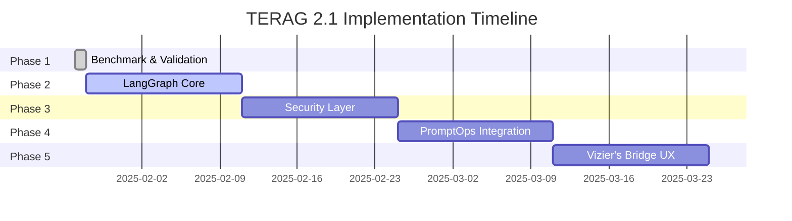

# 🗺️ TERAG 2.1 — Operational Upgrade Roadmap

**Кодовое имя:** *Vizier's Bridge*  
**Владелец:** Сергей Валерьевич  
**Версия:** 1.0  
**Статус:** Approved  
**Дата начала:** 2025-01-27

---

## 📋 Оглавление

1. [Обзор проекта](#обзор-проекта)
2. [Фазы реализации](#фазы-реализации)
3. [Зависимости и временные рамки](#зависимости-и-временные-рамки)
4. [Метрики успеха](#метрики-успеха)
5. [CI/CD Pipeline](#cicd-pipeline)
6. [Риски и митигация](#риски-и-митигация)

---

## 🎯 Обзор проекта

### Цели

1. Повысить фактологическую точность и устойчивость reasoning
2. Внедрить полную трассировку рассуждений через LangGraph
3. Создать безопасный Guardrail-as-Router для защиты от Prompt Injection
4. Реализовать операционный цикл PromptOps и CI/CD пайплайн
5. Разработать визуальный интерфейс ReasonGraph (Vizier's Bridge)

### Фазы

```
Benchmark → T.R.A.C. → Ethics → PromptOps → Vizier
```

---

## 🚀 Фазы реализации

### Phase 1: Benchmark & Validation ✅

**Статус:** ✅ Завершено  
**Приоритет:** HIGH  
**Срок:** 2025-01-27 (завершено)

#### Задачи

- ✅ Создать три пайплайна (Vector, Graph, Hybrid) в `src/benchmark/pipelines/`
- ✅ Интегрировать RAGAs для автоматической оценки Faithfulness/Recall
- ✅ Регистрировать результаты в MLflow + отчёт `benchmark_report.json`
- ✅ Установить минимальные пороги метрик: Faithfulness ≥ 0.9, Recall ≥ 0.9

#### Результат

Документированный baseline TERAG Benchmark с метриками AI-REPS (R1–R3, E1–E2).

#### Метрики

| Метрика | Целевое | Минимум | Статус |
|---------|---------|---------|--------|
| Faithfulness | ≥ 0.90 | 0.85 | ⏳ В процессе |
| Context Precision | ≥ 0.85 | 0.80 | ⏳ В процессе |
| Context Recall | ≥ 0.90 | 0.85 | ⏳ В процессе |
| Answer Relevancy | ≥ 0.95 | 0.90 | ⏳ В процессе |

---

### Phase 2: LangGraph Core (T.R.A.C.) 🔴

**Статус:** ⏳ В очереди  
**Приоритет:** CRITICAL  
**Срок:** 2025-02-10 (2 недели)  
**Зависимости:** Phase 1 ✅

#### Задачи

1. **Создать LangGraph Core**
   - Создать `src/core/agents/langgraph_core.py` с классом `TERAGStateGraph`
   - Реализовать state machine с узлами:
     - `Planner_Node` — планирование рассуждения
     - `Solver_Node` — решение задачи
     - `Verifier_Node` — проверка результата
     - `Guardrail_Node` — фильтрация unsafe input
   - Интегрировать Scratchpad (Chain-of-Thought) в State
   - Сериализовать ReasonGraph JSON после каждого шага reasoning

2. **Интеграция с существующими компонентами**
   - Подключить к `TERAGEvolutionLoop`
   - Интегрировать с `KAGSolver`
   - Связать с `AI-REPS` метриками

3. **MLflow трассировка**
   - Логировать каждый шаг reasoning
   - Сохранять ReasonGraph JSON в MLflow
   - Создать audit-ленту

#### Результат

Рабочий T.R.A.C.-контур с трассировкой reasoning и audit-лентой в MLflow.

#### Метрики

| Метрика | Целевое | Описание |
|---------|---------|----------|
| Reasoning Trace Completeness | 100% | Все шаги логируются |
| State Transition Success Rate | ≥ 0.95 | Успешные переходы |
| Scratchpad Utilization | ≥ 0.80 | Использование рабочей памяти |

#### Временные рамки

- Неделя 1: Создание LangGraph Core, базовые узлы
- Неделя 2: Интеграция, тестирование, MLflow

---

### Phase 3: Security Layer (AI-REPS: S1–S2) 🔴

**Статус:** ⏳ В очереди  
**Приоритет:** HIGH  
**Срок:** 2025-02-24 (2 недели)  
**Зависимости:** Phase 2

#### Задачи

1. **Guardrail-as-Router**
   - Создать `Guardrail_Node` в LangGraph с классификацией safe/harmful
   - Реализовать условные переходы к отказу при harmful input
   - Интегрировать с существующим `EthicalFilter`

2. **Red Team тестирование**
   - Подключить Promptfoo Red Team тесты в CI/CD
   - Создать набор тестовых сценариев для OWASP LLM01
   - Автоматизировать запуск Red Team тестов

3. **Отчетность**
   - Собрать Red Team отчёт (`RedTeam_Report.json`)
   - Интегрировать результаты в MLflow
   - Создать dashboard для мониторинга безопасности

#### Результат

99% detection rate OWASP LLM01 + отчёт `RedTeam_Report.json`.

#### Метрики

| Метрика | Целевое | Описание |
|---------|---------|----------|
| OWASP LLM01 Detection Rate | ≥ 0.99 | Обнаружение prompt injection |
| Secure Reasoning Index | ≥ 0.8 | Индекс безопасного рассуждения |
| False Positive Rate | ≤ 0.05 | Ложные срабатывания |

#### Временные рамки

- Неделя 1: Guardrail Node, интеграция
- Неделя 2: Red Team тесты, отчетность

---

### Phase 4: PromptOps Integration 🔴

**Статус:** ⏳ В очереди  
**Приоритет:** HIGH  
**Срок:** 2025-03-10 (2 недели)  
**Зависимости:** Phase 2, Phase 3

#### Задачи

1. **MLflow Prompt Registry**
   - Развернуть MLflow Prompt Registry (`prompts/registry/`)
   - Создать структуру версионирования промптов
   - Реализовать алиасы `@dev`, `@staging`, `@prod`

2. **Backend интеграция**
   - Добавить загрузчик промптов в FastAPI backend (`prompt_loader.py`)
   - Создать API endpoints для управления промптами
   - Интегрировать с LangGraph Core

3. **CI/CD автоматизация**
   - Настроить GitHub Actions для автоматических проверок:
     - PromptLint (валидация промптов)
     - Bandit (безопасность)
     - pip-audit (уязвимости)
     - RAGAs Eval (качество)
   - Создать workflow для деплоя промптов

#### Результат

Полноценный PromptOps pipeline с version control и автоматической валидацией.

#### Метрики

| Метрика | Целевое | Описание |
|---------|---------|----------|
| Prompt Version Control | 100% | Все промпты версионированы |
| Automated Validation Rate | ≥ 0.95 | Автоматическая валидация |
| Prompt Deployment Time | ≤ 5 мин | Время деплоя |

#### Временные рамки

- Неделя 1: MLflow Registry, backend интеграция
- Неделя 2: CI/CD, тестирование

---

### Phase 5: Vizier's Bridge UX 🟡

**Статус:** ⏳ В очереди  
**Приоритет:** MEDIUM  
**Срок:** 2025-03-24 (2 недели)  
**Зависимости:** Phase 2, Phase 4

#### Задачи

1. **Backend SSE endpoint**
   - Разработать FastAPI SSE endpoint для стриминга ReasonGraph JSON
   - Реализовать real-time обновления reasoning flow
   - Оптимизировать производительность стриминга

2. **Frontend 3D визуализация**
   - Создать React Three Fiber компонент `TeragVizierScene`
   - Реализовать подсветку активных узлов
   - Добавить анимацию reasoning flow

3. **UX метрики**
   - Добавить метрику A.R.I. (Average Resonance Index) через UX-опросник
   - Интегрировать с AI-REPS метриками
   - Создать dashboard для визуализации

#### Результат

Иммерсивный UI ReasonGraph с измеримым UX-показателем доверия пользователя.

#### Метрики

| Метрика | Целевое | Описание |
|---------|---------|----------|
| Cognitive Resonance Index | ≥ 0.8 | Индекс когнитивного резонанса |
| User Trust Score | ≥ 0.85 | Доверие пользователя |
| Visualization FPS | ≥ 60 | Производительность 3D |

#### Временные рамки

- Неделя 1: Backend SSE, базовый 3D компонент
- Неделя 2: Анимации, UX метрики, оптимизация

---

## 📊 Зависимости и временные рамки

### Диаграмма зависимостей



### Критический путь

```
Phase 1 (Benchmark) → Phase 2 (LangGraph) → Phase 3 (Security) → Phase 4 (PromptOps) → Phase 5 (Vizier)
                                    ↓
                            Phase 2 → Phase 5 (Vizier)
```

**Общая длительность:** ~8 недель (56 дней)

---

## 🎯 Метрики успеха

### Общие метрики проекта

| Метрика | Целевое | Минимум | Текущее |
|---------|---------|---------|---------|
| **Faithfulness** | ≥ 0.90 | 0.85 | ⏳ В процессе |
| **Context Precision** | ≥ 0.85 | 0.80 | ⏳ В процессе |
| **Context Recall** | ≥ 0.90 | 0.85 | ⏳ В процессе |
| **Secure Reasoning Index** | ≥ 0.8 | 0.75 | ⏳ В процессе |
| **OWASP LLM01 Detection Rate** | ≥ 0.99 | 0.95 | ⏳ В процессе |
| **Cognitive Resonance Index** | ≥ 0.8 | 0.75 | ⏳ В процессе |

### Метрики по фазам

#### Phase 1: Benchmark ✅
- ✅ Структура создана
- ⏳ Метрики в процессе измерения

#### Phase 2: LangGraph Core
- Reasoning Trace Completeness: 100%
- State Transition Success Rate: ≥ 0.95
- Scratchpad Utilization: ≥ 0.80

#### Phase 3: Security Layer
- OWASP LLM01 Detection Rate: ≥ 0.99
- Secure Reasoning Index: ≥ 0.8
- False Positive Rate: ≤ 0.05

#### Phase 4: PromptOps
- Prompt Version Control: 100%
- Automated Validation Rate: ≥ 0.95
- Prompt Deployment Time: ≤ 5 мин

#### Phase 5: Vizier's Bridge
- Cognitive Resonance Index: ≥ 0.8
- User Trust Score: ≥ 0.85
- Visualization FPS: ≥ 60

---

## 🔄 CI/CD Pipeline

### Инструменты

- **MLflow** — логирование экспериментов и метрик
- **LangSmith** — трассировка LLM вызовов
- **RAGAs** — оценка качества RAG
- **Promptfoo** — Red Team тестирование
- **Bandit** — проверка безопасности кода
- **pip-audit** — проверка уязвимостей зависимостей

### Этапы

1. **Unit Tests** — автоматические тесты
2. **PromptLint** — валидация промптов
3. **Security Scan** — Bandit + pip-audit
4. **RAG Eval** — RAGAs оценка
5. **Red Team** — Promptfoo тесты
6. **Deploy** — развертывание

### Отчетность

- **MLflow UI** — визуализация экспериментов
- **GitHub Actions Artifacts** — сохранение отчетов
- **LangSmith Dash** — мониторинг LLM вызовов

---

## 📦 Deliverables

### Документы

- ✅ `benchmark_report.json` — результаты benchmark
- ⏳ `redteam_report.json` — результаты Red Team тестов
- ⏳ `reason_graph.json` — структура reasoning
- ⏳ `mlflow_run_logs/` — логи экспериментов
- ⏳ `vizier_scene.jsx` — 3D компонент визуализации

### Код

- ✅ `src/benchmark/` — benchmark система
- ⏳ `src/core/agents/langgraph_core.py` — LangGraph Core
- ⏳ `src/core/agents/guardrail_node.py` — Guardrail Node
- ⏳ `prompts/registry/` — Prompt Registry
- ⏳ `src/api/prompt_loader.py` — загрузчик промптов
- ⏳ `src/components/vizier/TeragVizierScene.tsx` — 3D визуализация

---

## ⚠️ Риски и митигация

### Технические риски

| Риск | Вероятность | Влияние | Митигация |
|------|-------------|---------|-----------|
| LangGraph интеграция сложнее ожидаемого | Средняя | Высокое | Начать с простых узлов, постепенно усложнять |
| Производительность 3D визуализации | Средняя | Среднее | Оптимизация, LOD, инстансинг |
| Red Team тесты не покрывают все атаки | Низкая | Высокое | Расширить набор тестов, использовать OWASP Top 10 |

### Временные риски

| Риск | Вероятность | Влияние | Митигация |
|------|-------------|---------|-----------|
| Задержка Phase 2 блокирует остальные | Средняя | Высокое | Параллельная работа над независимыми задачами |
| Недостаточно времени на тестирование | Низкая | Среднее | Автоматизация тестов, CI/CD |

### Ресурсные риски

| Риск | Вероятность | Влияние | Митигация |
|------|-------------|---------|-----------|
| Недостаточно данных для benchmark | Низкая | Среднее | Использовать синтетические данные, MultiHop-QA |

---

## 📅 Календарный план

### Неделя 1-2 (2025-01-27 - 2025-02-10): Phase 2 — LangGraph Core

**Цель:** Создать базовый LangGraph Core с трассировкой

**Задачи:**
- День 1-3: Создание `TERAGStateGraph` и базовых узлов
- День 4-7: Интеграция Scratchpad и сериализация ReasonGraph
- День 8-10: Интеграция с существующими компонентами
- День 11-14: Тестирование и MLflow интеграция

### Неделя 3-4 (2025-02-10 - 2025-02-24): Phase 3 — Security Layer

**Цель:** Реализовать Guardrail-as-Router и Red Team тесты

**Задачи:**
- День 1-4: Создание Guardrail_Node
- День 5-7: Интеграция с LangGraph
- День 8-10: Настройка Promptfoo
- День 11-14: Red Team тесты и отчетность

### Неделя 5-6 (2025-02-24 - 2025-03-10): Phase 4 — PromptOps

**Цель:** Развернуть PromptOps pipeline

**Задачи:**
- День 1-4: MLflow Prompt Registry
- День 5-7: Backend интеграция
- День 8-10: CI/CD автоматизация
- День 11-14: Тестирование и документация

### Неделя 7-8 (2025-03-10 - 2025-03-24): Phase 5 — Vizier's Bridge

**Цель:** Создать 3D визуализацию ReasonGraph

**Задачи:**
- День 1-4: Backend SSE endpoint
- День 5-8: Frontend 3D компонент
- День 9-11: Анимации и UX метрики
- День 12-14: Оптимизация и финализация

---

## 🎯 Критерии завершения

### Phase 2: LangGraph Core

- ✅ Все узлы реализованы и протестированы
- ✅ ReasonGraph JSON сериализуется корректно
- ✅ MLflow трассировка работает
- ✅ Интеграция с существующими компонентами

### Phase 3: Security Layer

- ✅ Guardrail_Node обнаруживает 99% вредоносных запросов
- ✅ Red Team тесты проходят
- ✅ Отчет `RedTeam_Report.json` генерируется

### Phase 4: PromptOps

- ✅ Prompt Registry работает
- ✅ CI/CD автоматизация настроена
- ✅ Алиасы `@dev`, `@staging`, `@prod` функционируют

### Phase 5: Vizier's Bridge

- ✅ 3D визуализация работает с 60+ FPS
- ✅ Real-time обновления через SSE
- ✅ UX метрики собираются

---

## 🔗 Связанные документы

- [Implementation Plan](../cursor_task.json) — JSON план реализации
- [TERAG 2.1 Benchmark](../docs/TERAG_2.1_BENCHMARK.md) — Benchmark документация
- [Comprehensive Audit Report](../docs/COMPREHENSIVE_AUDIT_REPORT.md) — Полный аудит

---

**Последнее обновление:** 2025-01-27  
**Следующий review:** 2025-02-10 (после Phase 2)


