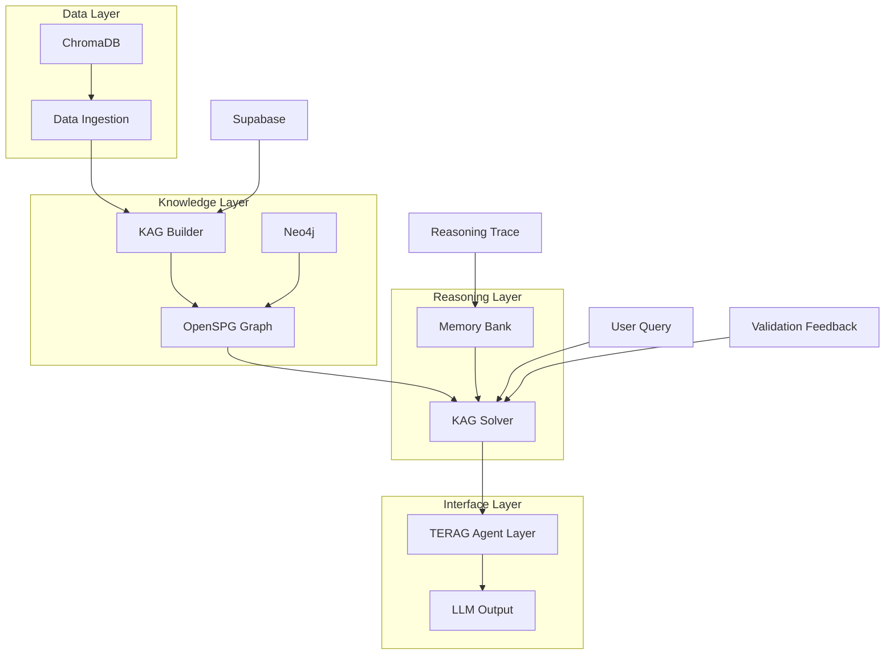

# 🏗️ KAG Integration Architecture

## Обзор

Архитектурная схема TERAG с интеграцией KAG (Knowledge-Augmented Generation) для перехода на reasoning-ядро нового поколения.

## Диаграмма архитектуры



## Компоненты системы

### 1. Data Ingestion
- **Назначение:** Загрузка и предобработка документов
- **Технологии:** Python, LangChain, ChromaDB
- **Входы:** PDF, Markdown, текстовые файлы
- **Выходы:** Обработанные чанки текста

### 2. KAG Builder
- **Назначение:** Извлечение SPO-триплетов и построение графа
- **Технологии:** Python, OpenSPG, LLM
- **Входы:** Обработанные чанки
- **Выходы:** SPO-триплеты, граф знаний

### 3. OpenSPG Graph
- **Назначение:** Хранение и управление графом знаний
- **Технологии:** OpenSPG, Neo4j
- **Функции:** Валидация, запросы, обновления
- **Схема:** Концепты, агенты, процессы, решения

### 4. KAG Solver
- **Назначение:** Reasoning и генерация ответов
- **Технологии:** Python, LLM, Memory Bank
- **Входы:** Пользовательские запросы
- **Выходы:** Объяснимые ответы с reasoning trace

### 5. TERAG Agent Layer
- **Назначение:** Интерфейс между reasoning и UI
- **Технологии:** TypeScript, React, WebSocket
- **Функции:** API, валидация, мониторинг

### 6. Memory Bank
- **Назначение:** Долговременная память системы
- **Технологии:** Supabase, файловая система
- **Содержание:** Traces, паттерны, правила, инсайты

## Потоки данных

### 1. Поток обработки документов
```
Документ → Data Ingestion → KAG Builder → OpenSPG Graph → Neo4j
```

### 2. Поток reasoning
```
Запрос → KAG Solver → OpenSPG Graph → Memory Bank → Ответ
```

### 3. Поток обучения
```
Reasoning Trace → Memory Bank → Анализ → Обновление правил
```

## Интеграционные точки

### OpenSPG ↔ Neo4j
- Синхронизация графов
- Дублирование критических данных
- Backup и восстановление

### Supabase ↔ Memory Bank
- Хранение метаданных
- Аналитика и метрики
- Пользовательские данные

### ChromaDB ↔ KAG Builder
- Векторный поиск
- Семантическое извлечение
- Кэширование результатов

## Масштабируемость

### Горизонтальное масштабирование
- KAG Builder: множественные инстансы
- KAG Solver: load balancing
- OpenSPG: кластеризация

### Вертикальное масштабирование
- Увеличение ресурсов для каждого компонента
- Оптимизация запросов к графу
- Кэширование частых операций

## Безопасность

### Аутентификация
- JWT токены для API
- OAuth для внешних сервисов
- API ключи для OpenSPG

### Авторизация
- RBAC для пользователей
- Ограничения доступа к данным
- Аудит всех операций

### Защита данных
- Шифрование в покое
- Шифрование в транзите
- Регулярные бэкапы

## Мониторинг

### Метрики производительности
- Время обработки запросов
- Использование ресурсов
- Пропускная способность

### Метрики качества
- Faithfulness score
- Logic consistency
- User satisfaction

### Алерты
- Критические ошибки
- Превышение порогов
- Недоступность сервисов

---

**Версия:** 1.0  
**Дата:** 2025-10-24  
**Статус:** В разработке


