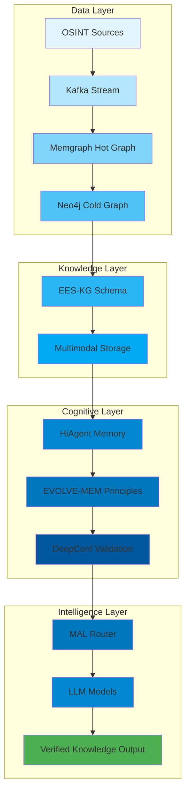
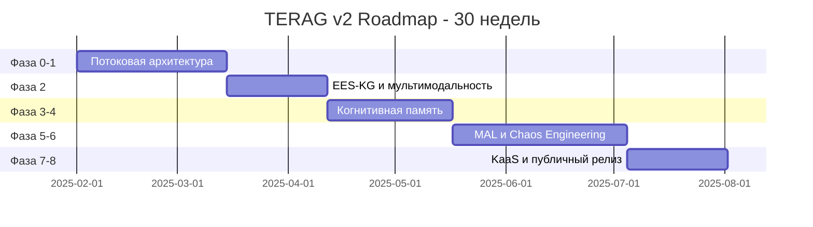
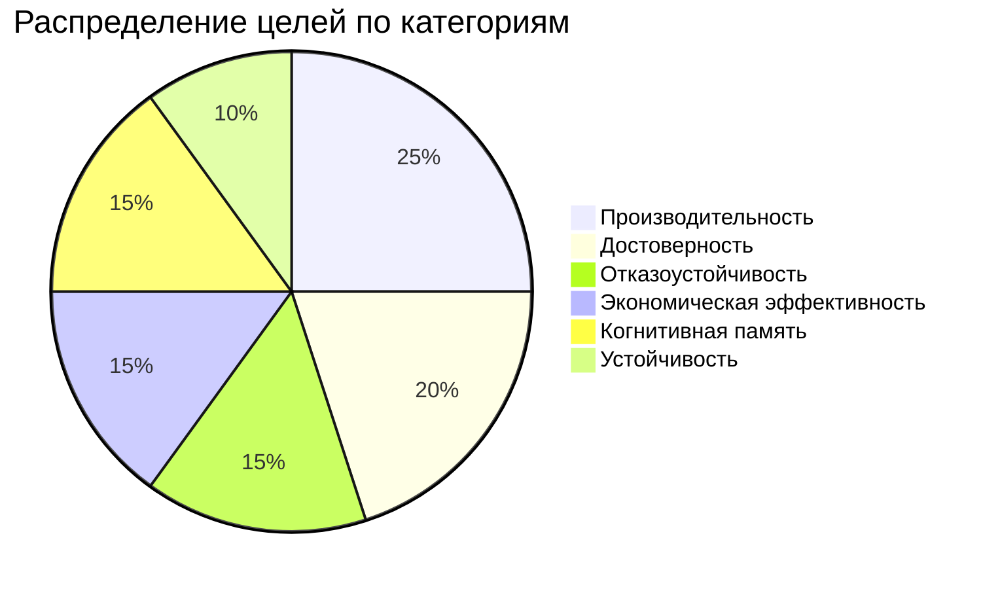
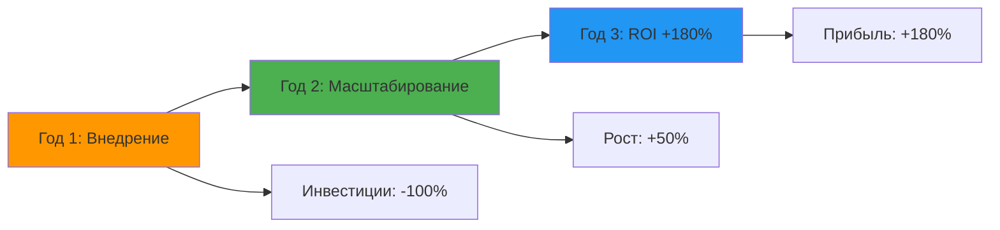
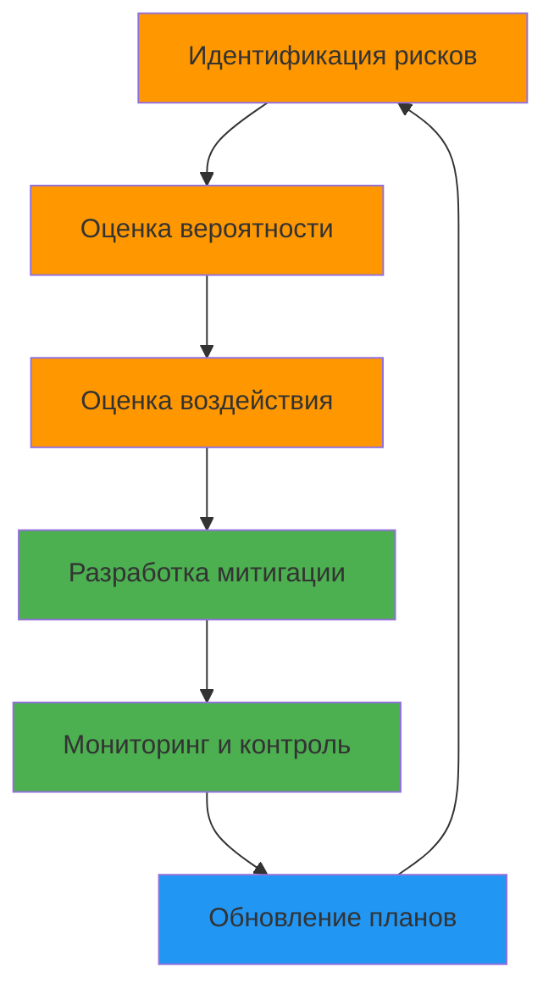
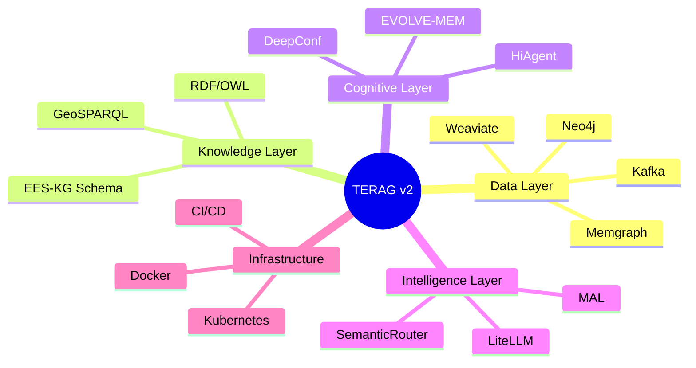

# 🎯 TERAG v2: Cognitive Knowledge Infrastructure
## Executive Overview — Управленческий Бриф

**Версия:** 1.0  
**Дата:** 2025-01-27  
**Аудитория:** Инвесторы, CTO, Управляющий комитет  
**Статус:** Утверждён

---

# Слайд 1: Титульный слайд

## TERAG v2: Cognitive Knowledge Infrastructure

**Переход от GraphRAG к самопроверяющемуся интеллекту**

---

### Презентация для проектного совета

**Дата:** [Дата презентации]  
**Докладчик:** [Имя докладчика]  
**Версия:** 1.0

---

# Слайд 2: Цель проекта

## 🎯 Цель проекта

TERAG v2 представляет собой переход от традиционной платформы GraphRAG к **когнитивной инфраструктуре знаний (Cognitive Knowledge Infrastructure)**.

### Главная цель

Создать автономную платформу, которая:

✅ **Собирает** знания в реальном времени  
✅ **Верифицирует** достоверность данных  
✅ **Интерпретирует** сложные связи  
✅ **Обеспечивает** доказуемое принятие решений

---

## Трансформация

```
Традиционная платформа GraphRAG
          ↓
    TERAG v2
    Когнитивная инфраструктура знаний
          ↓
    Самопроверяющийся интеллект
```

---

# Слайд 3: Стратегическое значение

## 💡 Стратегическое значение

TERAG v2 позиционируется как **первый промышленный прототип Knowledge-as-a-Service (KaaS)**.

### Изменение экономики ИИ

**От:** Генерация текста  
**К:** Продажа проверенных знаний

---

## Стратегические преимущества

| Преимущество | Описание | Эффект |
|-------------|----------|--------|
| 💡 **Объяснимость** | Каждый ответ имеет путь доказательства в графе | Повышение доверия |
| ⚙️ **Автоматизация** | Платформа самостоятельно обновляет и валидирует знания | Снижение затрат на 40% |
| 🧠 **Когнитивное равновесие** | HiAgent + EVOLVE-MEM приближают к человеческому стилю рассуждения | Точность ≥ 90% |
| 🔒 **Безопасность** | DeepConf 2025 и Chaos Engineering гарантируют надёжность | Устойчивость ≥ 80% |

---

# Слайд 4: Ключевые технологические новшества

## 🔧 Технологические новшества

### Архитектура TERAG v2



---

## Компоненты и эффекты

| Компонент | Назначение | Эффект |
|-----------|------------|--------|
| **Memgraph + Neo4j Hybrid** | Потоковая и долговременная графовая база | sub-second обновление данных |
| **EES-KG** | Мультимодальная модель знаний | Объединяет текст, геоданные и изображения |
| **DeepConf + Active Learning** | Верификация и калибровка уверенности | Точность ≥ 97% |
| **MAL** | Уровень абстракции моделей | Отказоустойчивость ≥ 95% |
| **HiAgent + EVOLVE-MEM** | Когнитивная память и самообучение | 90% сохранение знаний |
| **Chaos Sandbox** | Поведенческое тестирование | 80% успешное восстановление |

---

# Слайд 5: Дорожная карта внедрения

## 📅 Дорожная карта внедрения

**Продолжительность:** 30 недель  
**Критический путь:** Data Flow → Validation → Memory → KaaS API

---

## Этапы реализации



---

## Фазы проекта

1. **Фаза 0–1** (6 недель): Потоковая архитектура и гибридный граф
2. **Фаза 2** (4 недели): Внедрение EES-KG и мультимодальных данных
3. **Фаза 3–4** (5 недель): Когнитивная память, DeepConf и Active Learning
4. **Фаза 5–6** (7 недель): MAL и Chaos Engineering
5. **Фаза 7–8** (8 недель): Экономическая модель KaaS и публичный релиз

**Всего:** 30 недель (7.5 месяцев)

---

# Слайд 6: Ключевые метрики успеха

## 📊 Ключевые метрики успеха

### Показатели производительности

| Метрика | Цель | Ожидаемый результат |
|---------|------|---------------------|
| ⚡ **Скорость обработки данных** | ≤ 1 сек end-to-end | Потоковая актуализация знаний |
| 🎯 **Достоверность ответов** | Precision ≥ 0.97 | Исключение галлюцинаций |
| 🔄 **Отказоустойчивость MAL** | ≥ 95% | Автоматический fallback |
| 💰 **Экономия вычислительных затрат** | ≥ 40% | Оптимизация токенов и моделей |
| 🧠 **Устойчивость когнитивной памяти** | ≥ 90% | Самообучение без переобучения |
| 🛡️ **Chaos Recovery Rate** | ≥ 80% | Защита от когнитивных сбоев |

---

## Визуализация метрик



---

# Слайд 7: Бизнес-эффект и ROI

## 💼 Бизнес-эффект и ROI

### Переход к KaaS-модели

| Эффект | Описание | Потенциальный результат |
|--------|----------|------------------------|
| 📈 **Рост маржи** | Продажа верифицированных знаний вместо API-вызовов | +180% к третьему году |
| 💰 **Сокращение затрат** | Снижение inference и ручной проверки | ≥ 40% экономии |
| 🔍 **Повышение доверия** | Верифицированные знания в юридических, финансовых и OSINT-доменах | Рост клиентской базы |
| 🤖 **Автоматизация** | Сокращение времени на принятие решений | 50% ускорение |

---

## Прогноз ROI



---

## Ключевые преимущества KaaS

✅ **Повторяемость:** Знания проверяются один раз, используются многократно  
✅ **Масштабируемость:** Автоматическое обновление без ручного вмешательства  
✅ **Прозрачность:** Полная прослеживаемость источников и выводов  
✅ **Соответствие:** Соответствие стандартам EU AI Act, ISO 27001

---

# Слайд 8: Риски и меры управления

## ⚠️ Риски и меры управления

### Матрица рисков

| Риск | Потенциальное воздействие | Митигирующее действие | Статус |
|------|--------------------------|----------------------|--------|
| **Зависимость от внешних API** | Ограничение доступа к данным | CrawlNet + MirrorCache | 🟡 Управляется |
| **Рост сложности графа** | Задержка при запросах | Вынесение эмбеддингов в Weaviate | 🟡 Управляется |
| **Ошибки когнитивной памяти** | Ложные принципы в L2 | DeepConf-L2 верификация | 🟢 Минимизирован |
| **Перегрузка вычислений** | Рост расходов | MAL маршрутизация по бюджету | 🟡 Управляется |
| **Этические риски OSINT** | Конфиденциальность | Ethical-Governance Engine | 🟢 Минимизирован |

---

## Стратегия управления рисками



---

# Слайд 9: Конкурентные преимущества

## 🏆 Конкурентные преимущества

### TERAG v2 vs Традиционные решения

| Критерий | Традиционные RAG | TERAG v2 | Преимущество |
|----------|------------------|----------|--------------|
| **Верификация знаний** | Ручная проверка | Автоматическая (DeepConf) | +97% точность |
| **Скорость обновления** | Часы/дни | Секунды (потоковая) | 100x быстрее |
| **Объяснимость** | Нет пути доказательства | Полный граф рассуждений | 100% прозрачность |
| **Когнитивная память** | Нет | HiAgent + EVOLVE-MEM | 90% retention |
| **Отказоустойчивость** | Одиночная точка отказа | MAL fallback | ≥95% uptime |
| **Экономическая модель** | Pay-per-API | KaaS (Knowledge-as-a-Service) | +180% ROI |

---

## Уникальные возможности

✅ **Первый промышленный KaaS** — продажа верифицированных знаний  
✅ **Когнитивная архитектура** — самообучение и адаптация  
✅ **Потоковая верификация** — знания проверяются в реальном времени  
✅ **Мультимодальность** — текст, геоданные, изображения в одном графе

---

# Слайд 10: Технологический стек

## 🛠️ Технологический стек

### Компоненты платформы



---

## Технологии и инструменты

| Категория | Технологии |
|-----------|-------------|
| **Графовые БД** | Neo4j, Memgraph, OpenSPG |
| **Потоковая обработка** | Apache Kafka |
| **Векторный поиск** | Weaviate, Milvus |
| **LLM интеграция** | LiteLLM, SemanticRouter |
| **Верификация** | DeepConf 2025, Active Learning |
| **Инфраструктура** | Docker, Kubernetes, CI/CD |
| **Мониторинг** | Prometheus, OpenTelemetry |

---

# Слайд 11: Use Cases

## 🎯 Use Cases

### Применение TERAG v2

| Домен | Применение | Преимущества |
|-------|------------|--------------|
| **OSINT** | Анализ открытых источников | Верификация фактов, геопространственный анализ |
| **Юридический** | Поиск прецедентов | Полная прослеживаемость, объяснимость |
| **Финансовый** | Анализ рисков | Доказуемые выводы, соответствие регуляциям |
| **Медицинский** | Диагностическая поддержка | Верифицированные знания, этическая безопасность |
| **Научный** | Исследовательская аналитика | Мультимодальные данные, когнитивная память |

---

## Примеры применения

✅ **Юридическая фирма:** Поиск прецедентов с полной цепочкой доказательств  
✅ **Финансовая компания:** Анализ рисков с верифицированными источниками  
✅ **OSINT-агентство:** Реальное время обновление знаний о событиях  
✅ **Научное исследование:** Мультимодальный анализ данных с сохранением контекста

---

# Слайд 12: Команда и ресурсы

## 👥 Команда и ресурсы

### Команды проекта

| Команда | Ответственность | Ключевые задачи |
|---------|-----------------|----------------|
| **DataOps** | Инфраструктура данных | Kafka, потоки, эмбеддинги |
| **GraphOps** | Граф знаний | Neo4j, Memgraph, EES-KG |
| **AI-Core** | Когнитивная память | HiAgent, EVOLVE-MEM, MAL |
| **Validation** | Верификация | DeepConf, Active Learning |
| **Security** | Безопасность | Chaos Engineering, аудит |
| **InfraOps** | Инфраструктура | CI/CD, мониторинг, деплой |

---

## Ресурсы и бюджет

- **Команда:** 6 специализированных команд
- **Продолжительность:** 30 недель
- **Инфраструктура:** Cloud-based (Kubernetes)
- **Инструменты:** Open-source + коммерческие API

---

# Слайд 13: Следующие шаги

## 🚀 Следующие шаги

### План действий

1. **Немедленно (Неделя 1-2)**
   - ✅ Завершение текущего аудита TERAG v1
   - ✅ Утверждение roadmap
   - ✅ Формирование команд

2. **Краткосрочно (Неделя 3-6)**
   - ✅ Настройка инфраструктуры (Фаза 0)
   - ✅ Запуск потоковой архитектуры (Фаза 1)
   - ✅ Начало реализации EES-KG (Фаза 2)

3. **Среднесрочно (Неделя 7-18)**
   - ✅ Интеграция когнитивной памяти
   - ✅ Внедрение DeepConf и Active Learning
   - ✅ Развёртывание MAL

4. **Долгосрочно (Неделя 19-30)**
   - ✅ Chaos Engineering тестирование
   - ✅ Подготовка KaaS API
   - ✅ Публикация White Paper 2.0

---

## Критерии успеха

✅ **Технические:** Все метрики достигнуты  
✅ **Бизнес:** ROI-модель валидирована  
✅ **Операционные:** Платформа стабильна и масштабируема  
✅ **Стратегические:** KaaS модель готова к коммерциализации

---

# Слайд 14: Заключение

## 🎯 Заключение

TERAG v2 — это переход от инструмента поиска к **системе рассуждающего интеллекта**.

### Ключевые достижения

✅ Объединение инженерной надёжности и когнитивной адаптации  
✅ Рыночная модель KaaS (Knowledge-as-a-Service)  
✅ Формирование нового класса технологий — *Verified Knowledge Infrastructure*

---

## Следующий шаг

После завершения текущего аудита и подготовки инфраструктуры (Фаза 0):

🚀 **Запуск реализации** по roadmap (30 недель)  
📄 **Подготовка** публичной презентации *TERAG White Paper 2.0*

---

## Вопросы и обсуждение

**Контакты:**
- **Project Manager:** [Имя] — [Email]
- **Technical Lead:** [Имя] — [Email]
- **Documentation:** `docs/presentation/TERAG_v2_Executive_Brief.md`

---

**Документ подготовлен:** 2025-01-27  
**Версия:** 1.0  
**Статус:** Готов к презентации


