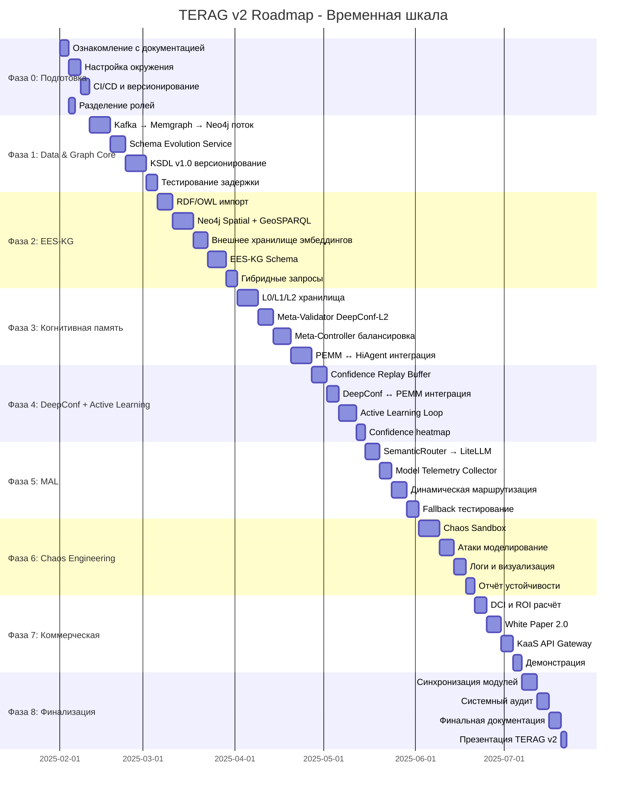
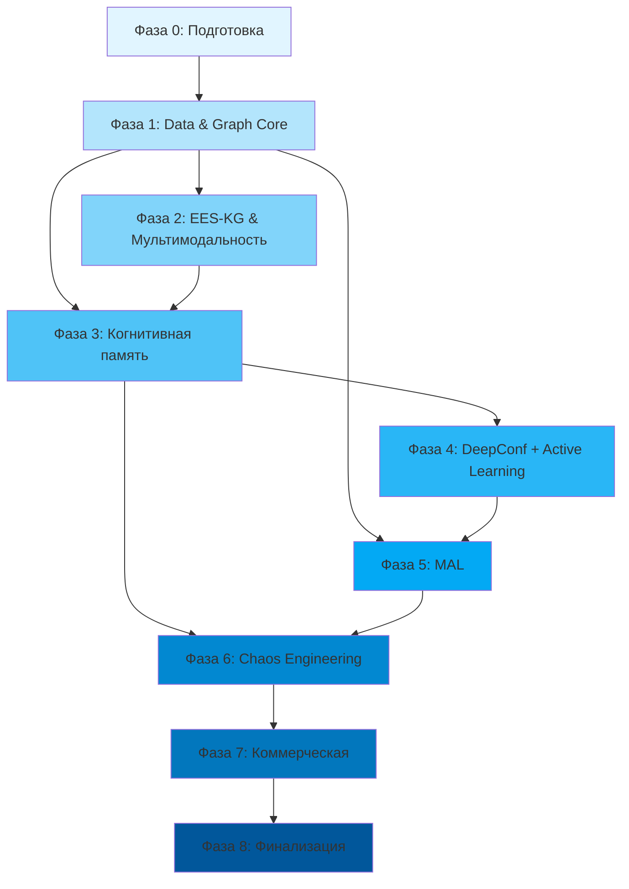

# 🧭 TERAG v2 — Cursor Engineering Roadmap

*(План внедрения архитектуры когнитивной платформы 2025–2026)*

**Версия:** 1.0  
**Дата создания:** 2025-01-27  
**Статус:** Утверждён  
**Классификация:** Внутренний документ

---

## 📋 Метаданные проекта

| Параметр | Значение |
|----------|----------|
| **Цель проекта** | Реализация TERAG v2 (KaaS Edition) |
| **Продолжительность** | 30 недель (7.5 месяцев) |
| **Дата начала** | _[Дата утверждения]_ |
| **Дата завершения** | _[Дата начала + 30 недель]_ |
| **Команды** | DataOps, GraphOps, AI-Core, Validation, Security, InfraOps |
| **Методология** | Agile, поэтапная разработка |

---

## 🎯 Executive Summary

Roadmap описывает поэтапный план внедрения TERAG v2 (KaaS Edition) с акцентом на:

- **Потоковую архитектуру** (Kafka → Memgraph → Neo4j)
- **Мультимодальный граф знаний** (EES-KG)
- **Когнитивную память** (HiAgent, EVOLVE-MEM)
- **Верификацию знаний** (DeepConf 2025)
- **Интеллектуальную маршрутизацию** (MAL)
- **Безопасность и устойчивость** (Chaos Engineering)

**Ключевой результат:** Готовая платформа TERAG v2 с готовностью к коммерческому использованию (KaaS).

---

## 📊 Временная шкала (Gantt Chart)

---

## 🔗 Граф зависимостей между фазами

---

## 📅 Детальный план по фазам

---

## 🧭 Фаза 0 — Подготовительная (Недели 1–2)

**Цель:** Сформировать основу для проектных артефактов и синхронизировать команды.

**Продолжительность:** 2 недели  
**Приоритет:** 🔴 Критический

### Задачи

- [ ] **Ознакомление с документацией**
  - Изучение `TERAG_v2_Specification`
  - Изучение EES-KG-концепции
  - Ознакомление с архитектурой KaaS Edition
  - **Ответственный:** Все команды
  - **Срок:** Неделя 1

- [ ] **Настройка окружения разработки**
  - Установка и настройка Kafka
  - Установка и настройка Neo4j
  - Установка и настройка Memgraph
  - Настройка LiteLLM
  - Настройка SemanticRouter
  - **Ответственный:** InfraOps
  - **Срок:** Неделя 1-2

- [ ] **CI/CD и версионирование**
  - Развёртывание тестового контура CI/CD
  - Настройка логики версионирования модулей
  - Интеграция с Git (tags, releases)
  - **Ответственный:** InfraOps
  - **Срок:** Неделя 2

- [ ] **Управление проектом**
  - Создание дашборда Jira/Notion для отслеживания фаз
  - Разделение ролей: DataOps, GraphOps, AI-Core, Validation, Security
  - Настройка коммуникационных каналов
  - **Ответственный:** Project Manager
  - **Срок:** Неделя 1

### Результаты

- ✅ Подготовлено окружение разработки
- ✅ Разделены роли команд
- ✅ Готов baseline-документ `TERAG_Infra_Setup_Report.md`

### KPI

- ✅ Окружение развёрнуто и протестировано
- ✅ Все команды синхронизированы
- ✅ CI/CD pipeline работает

---

## ⚙️ Фаза 1 — Data & Graph Core (Недели 3–6)

**Цель:** Реализовать потоковую архитектуру и двухуровневый граф знаний.

**Продолжительность:** 4 недели  
**Приоритет:** 🔴 Критический  
**Зависимости:** Фаза 0 (Kafka, Memgraph установлены)

### Задачи

- [ ] **Настройка потока Kafka → Memgraph → Neo4j**
  - Конфигурация Kafka topics
  - Настройка Memgraph для "горячего" графа
  - Настройка Neo4j для "холодного" графа
  - Реализация синхронизации между графами
  - **Ответственный:** DataOps, GraphOps
  - **Срок:** Недели 3-4

- [ ] **Schema Evolution Service**
  - Создание микросервиса для синхронизации схем EES-KG
  - API для управления схемами
  - Версионирование схем
  - **Ответственный:** GraphOps
  - **Срок:** Неделя 5

- [ ] **KSDL v1.0 версионирование**
  - Разработка спецификации KSDL (Knowledge Schema Definition Language)
  - Реализация системы версионирования схем
  - Миграционные скрипты
  - **Ответственный:** GraphOps
  - **Срок:** Неделя 6

- [ ] **Тестирование производительности**
  - Проверка задержки на тестовой выборке
  - Цель: latency ≤ 1 сек
  - Нагрузочное тестирование
  - **Ответственный:** DataOps
  - **Срок:** Неделя 6

- [ ] **Визуализация**
  - Подготовка `TERAG_DataFlow_Diagram.mmd`
  - Документация потоков данных
  - **Ответственный:** GraphOps
  - **Срок:** Неделя 6

### Результаты

- ✅ Потоковая передача данных работает стабильно
- ✅ "Горячий" и "холодный" графы синхронизируются автоматически
- ✅ Latency ≤ 1 сек достигнута

### KPI

| Метрика | Целевое значение | Фактическое | Статус |
|---------|------------------|-------------|--------|
| **Data Latency** | ≤ 1 сек | ___ сек | 🟢🟡🔴 |
| **Sync Success Rate** | ≥ 99% | ___% | 🟢🟡🔴 |
| **Schema Versioning** | Работает | ✅/❌ | 🟢🟡🔴 |

---

## 🧩 Фаза 2 — EES-KG & Мультимодальность (Недели 7–10)

**Цель:** Реализовать структуру **Entity–Event–Scene** и геопространственные запросы.

**Продолжительность:** 4 недели  
**Приоритет:** 🔴 Критический  
**Зависимости:** Фаза 1 (Graph Core готов)

### Задачи

- [ ] **Импорт RDF/OWL-онтологии**
  - Интеграция с Neosemantics
  - Конвертация RDF/OWL в Neo4j
  - Валидация онтологии
  - **Ответственный:** GraphOps
  - **Срок:** Неделя 7

- [ ] **Neo4j Spatial + GeoSPARQL**
  - Активация Neo4j Spatial расширения
  - Настройка GeoSPARQL поддержки
  - Тестирование геопространственных запросов
  - **Ответственный:** GraphOps
  - **Срок:** Неделя 8

- [ ] **Внешнее хранилище эмбеддингов**
  - Выбор решения (Weaviate или Milvus)
  - Установка и настройка
  - Интеграция с Graph Core
  - **Ответственный:** DataOps
  - **Срок:** Неделя 9

- [ ] **EES-KG Schema**
  - Формирование `EES-KG_Schema.json`
  - Описание связи с KSDL
  - Документация структуры Entity–Event–Scene
  - **Ответственный:** GraphOps
  - **Срок:** Неделя 9-10

- [ ] **Гибридные запросы**
  - Тестирование запросов `geo+semantic+graph`
  - Оптимизация производительности
  - Документация примеров запросов
  - **Ответственный:** GraphOps
  - **Срок:** Неделя 10

### Результаты

- ✅ Полный EES-KG поддерживает мультимодальные данные
- ✅ Запросы `geo+semantic+graph` выполняются ≤ 3 сек

### KPI

| Метрика | Целевое значение | Фактическое | Статус |
|---------|------------------|-------------|--------|
| **Hybrid Query Performance** | ≤ 3 сек | ___ сек | 🟢🟡🔴 |
| **GeoSPARQL Support** | 100% | ___% | 🟢🟡🔴 |
| **Multimodal Data Support** | Работает | ✅/❌ | 🟢🟡🔴 |

---

## 🧠 Фаза 3 — Когнитивная память и мышление (Недели 11–15)

**Цель:** Интегрировать **HiAgent** и **EVOLVE-MEM** как ядро памяти агента.

**Продолжительность:** 5 недель  
**Приоритет:** 🟡 Высокий  
**Зависимости:** Фаза 1 (Graph Core), Фаза 2 (EES-KG готов)

### Задачи

- [ ] **L0/L1/L2 хранилища**
  - Реализация хранилищ для разных уровней памяти
  - L0: Кратковременная память (миссии)
  - L1: Среднесрочная память (паттерны)
  - L2: Долговременная память (принципы)
  - **Ответственный:** AI-Core
  - **Срок:** Недели 11-12

- [ ] **Meta-Validator DeepConf-L2**
  - Реализация валидатора для проверки логики принципов
  - Интеграция с DeepConf API
  - Тестирование валидации
  - **Ответственный:** Validation
  - **Срок:** Неделя 13

- [ ] **Meta-Controller**
  - Настройка балансировки System 1 / System 2
  - Реализация логики переключения
  - Тестирование производительности
  - **Ответственный:** AI-Core
  - **Срок:** Неделя 14

- [ ] **PEMM ↔ HiAgent ↔ EVOLVE-MEM интеграция**
  - Обеспечение связи между компонентами
  - Тестирование взаимодействия
  - Оптимизация производительности
  - **Ответственный:** AI-Core
  - **Срок:** Неделя 15

### Результаты

- ✅ Агент способен формулировать подцели (HiAgent)
- ✅ EVOLVE-MEM хранит принципы и применяет их при последующих миссиях

### KPI

| Метрика | Целевое значение | Фактическое | Статус |
|---------|------------------|-------------|--------|
| **HiAgent Goal Formulation** | Работает | ✅/❌ | 🟢🟡🔴 |
| **EVOLVE-MEM Retention** | ≥ 90% | ___% | 🟢🟡🔴 |
| **Memory Access Latency** | < 500 мс | ___ мс | 🟢🟡🔴 |

---

## 🧩 Фаза 4 — DeepConf + Active Learning (Недели 16–18)

**Цель:** Создать доверительный цикл верификации знаний.

**Продолжительность:** 3 недели  
**Приоритет:** 🟡 Высокий  
**Зависимости:** Фаза 3 (HiAgent готов)

### Задачи

- [ ] **Confidence Replay Buffer**
  - Реализация буфера для повторного обучения критика
  - Механизм выборки данных
  - Интеграция с DeepConf
  - **Ответственный:** Validation
  - **Срок:** Неделя 16

- [ ] **DeepConf ↔ PEMM интеграция**
  - Настройка пометки сомнительных фактов
  - API для взаимодействия
  - Тестирование интеграции
  - **Ответственный:** Validation, AI-Core
  - **Срок:** Неделя 17

- [ ] **Active Learning Loop**
  - Внедрение цикла ручной проверки низкоуверенных данных
  - Интерфейс для экспертов
  - Автоматизация обратной связи
  - **Ответственный:** Validation
  - **Срок:** Неделя 18

- [ ] **Confidence heatmap**
  - Добавление визуализации confidence heatmap в QA Dashboard
  - Интеграция с дашбордом
  - Тестирование визуализации
  - **Ответственный:** Validation
  - **Срок:** Неделя 18

### Результаты

- ✅ Средняя достоверность DeepConf ≥ 0.97
- ✅ Сокращение ручных проверок на ≥ 60%

### KPI

| Метрика | Целевое значение | Фактическое | Статус |
|---------|------------------|-------------|--------|
| **Average DeepConf Score** | ≥ 0.97 | ___ | 🟢🟡🔴 |
| **Manual Review Reduction** | ≥ 60% | ___% | 🟢🟡🔴 |
| **Active Learning Efficiency** | ≥ 0.85 | ___ | 🟢🟡🔴 |

---

## 🔄 Фаза 5 — MAL (Model Abstraction Layer) (Недели 19–21)

**Цель:** Реализовать интеллектуальную маршрутизацию запросов.

**Продолжительность:** 3 недели  
**Приоритет:** 🟡 Высокий  
**Зависимости:** Фаза 4 (DeepConf готов)

### Задачи

- [ ] **SemanticRouter → LiteLLM интеграция**
  - Настройка маршрутизации на основе семантики
  - Конфигурация LiteLLM
  - Тестирование маршрутизации
  - **Ответственный:** AI-Core
  - **Срок:** Неделя 19

- [ ] **Model Telemetry Collector**
  - Реализация сбора метрик моделей
  - Хранение метрик
  - API для доступа к метрикам
  - **Ответственный:** AI-Core
  - **Срок:** Неделя 20

- [ ] **Динамическая маршрутизация**
  - Реализация адаптации весов
  - Алгоритм оптимизации маршрутизации
  - Тестирование адаптации
  - **Ответственный:** AI-Core
  - **Срок:** Неделя 21

- [ ] **Fallback-поведение**
  - Проверка fallback при сбое модели
  - Тестирование отказоустойчивости
  - Документация процедур
  - **Ответственный:** AI-Core
  - **Срок:** Неделя 21

### Результаты

- ✅ MAL обеспечивает отказоустойчивость ≥ 95%
- ✅ Средняя задержка вызова LLM ≤ 2 сек

### KPI

| Метрика | Целевое значение | Фактическое | Статус |
|---------|------------------|-------------|--------|
| **MAL Fallback Success** | ≥ 95% | ___% | 🟢🟡🔴 |
| **Average LLM Latency** | ≤ 2 сек | ___ сек | 🟢🟡🔴 |
| **Routing Accuracy** | ≥ 90% | ___% | 🟢🟡🔴 |

---

## 🧪 Фаза 6 — Поведенческий хаос-инжиниринг (Недели 22–25)

**Цель:** Протестировать устойчивость когнитивных компонентов TERAG.

**Продолжительность:** 4 недели  
**Приоритет:** 🟢 Средний  
**Зависимости:** Фаза 5 (MAL готов), Фаза 3 (HiAgent готов)

### Задачи

- [ ] **TERAG Chaos Sandbox**
  - Создание изолированной среды для тестирования
  - Настройка инструментов хаос-инжиниринга
  - Конфигурация мониторинга
  - **Ответственный:** Security
  - **Срок:** Неделя 22

- [ ] **Моделирование атак**
  - Memory Poisoning атаки
  - Goal Conflict сценарии
  - MAL Injection тесты
  - Документация сценариев
  - **Ответственный:** Security
  - **Срок:** Неделя 23

- [ ] **Логи и визуализация**
  - Настройка сбора логов
  - Создание визуализации хаоса
  - Дашборд для мониторинга
  - **Ответственный:** Security
  - **Срок:** Неделя 24

- [ ] **Отчёт устойчивости**
  - Составление `Chaos_Sandbox_TestPlan.md`
  - Таблица устойчивости компонентов
  - Рекомендации по улучшению
  - **Ответственный:** Security
  - **Срок:** Неделя 25

### Результаты

- ✅ Система восстанавливается в ≥ 80% тестов
- ✅ Отчёт подтверждает устойчивость когнитивных связей

### KPI

| Метрика | Целевое значение | Фактическое | Статус |
|---------|------------------|-------------|--------|
| **Chaos Recovery Rate** | ≥ 80% | ___% | 🟢🟡🔴 |
| **Attack Resistance** | ≥ 85% | ___% | 🟢🟡🔴 |
| **System Resilience** | ≥ 80% | ___% | 🟢🟡🔴 |

---

## 💼 Фаза 7 — Коммерческая и аналитическая (Недели 26–28)

**Цель:** Подготовить бизнес-доказательную базу для KaaS Edition.

**Продолжительность:** 3 недели  
**Приоритет:** 🟢 Средний  
**Зависимости:** Фаза 6 (Chaos Engineering завершён)

### Задачи

- [ ] **DCI и ROI расчёт**
  - Рассчитать Decision Cost Index
  - Подготовить `KaaS_Model_Economics.xlsx`
  - Анализ экономической эффективности
  - **Ответственный:** Business Analyst
  - **Срок:** Неделя 26

- [ ] **White Paper 2.0**
  - Подготовка презентации White Paper
  - Документация технических достижений
  - Бизнес-кейсы
  - **Ответственный:** Product Manager
  - **Срок:** Неделя 27

- [ ] **KaaS API Gateway**
  - Формирование API для клиентов
  - Документация API
  - Тестирование API
  - **Ответственный:** AI-Core, InfraOps
  - **Срок:** Неделя 27-28

- [ ] **Демонстрация**
  - Проведение тестовой демонстрации "Real-time Verified Knowledge"
  - Подготовка демо-сценариев
  - Запись презентации
  - **Ответственный:** Product Manager
  - **Срок:** Неделя 28

### Результаты

- ✅ ROI-модель готова
- ✅ KaaS API стабильно отдаёт верифицированные знания

### KPI

| Метрика | Целевое значение | Фактическое | Статус |
|---------|------------------|-------------|--------|
| **ROI Model Ready** | ✅ | ✅/❌ | 🟢🟡🔴 |
| **KaaS API Stability** | ≥ 99% | ___% | 🟢🟡🔴 |
| **White Paper Complete** | ✅ | ✅/❌ | 🟢🟡🔴 |

---

## 🚀 Фаза 8 — Финализация и пуск (Недели 29–30)

**Цель:** Интегрировать все компоненты и подготовить публикацию White Paper v2.

**Продолжительность:** 2 недели  
**Приоритет:** 🔴 Критический  
**Зависимости:** Все предыдущие фазы

### Задачи

- [ ] **Синхронизация модулей**
  - Финальная интеграция всех компонентов
  - Устранение конфликтов
  - Тестирование интеграции
  - **Ответственный:** Все команды
  - **Срок:** Неделя 29

- [ ] **Системный аудит**
  - Проведение системного аудита
  - Проверка Maturity Index ≥ 4
  - Устранение критических проблем
  - **Ответственный:** Audit Team
  - **Срок:** Неделя 29-30

- [ ] **Финальная документация**
  - Подготовка `TERAG_v2_Final_Spec.pdf`
  - Обновление всех документов
  - Финальная проверка
  - **Ответственный:** Technical Writers
  - **Срок:** Неделя 30

- [ ] **Презентация TERAG v2**
  - Запуск презентации TERAG v2 (внутренний релиз)
  - Подготовка материалов
  - Проведение презентации
  - **Ответственный:** Product Manager
  - **Срок:** Неделя 30

### Результаты

- ✅ Все модули интегрированы
- ✅ Аудит завершён без критических ошибок
- ✅ White Paper готов к публикации

### KPI

| Метрика | Целевое значение | Фактическое | Статус |
|---------|------------------|-------------|--------|
| **Integration Complete** | ✅ | ✅/❌ | 🟢🟡🔴 |
| **Maturity Index** | ≥ 4.0 | ___ | 🟢🟡🔴 |
| **Critical Issues** | 0 | ___ | 🟢🟡🔴 |

---

## 📊 Итоговые контрольные метрики проекта

| Категория | Цель | Метрика | Фактическое | Статус |
|-----------|------|---------|-------------|--------|
| **Архитектурная готовность** | Потоковая архитектура стабилизирована | latency ≤ 1s | ___ | 🟢🟡🔴 |
| **Достоверность знаний** | Верификация DeepConf | precision ≥ 0.97 | ___ | 🟢🟡🔴 |
| **Устойчивость** | Chaos Recovery | ≥ 80% | ___% | 🟢🟡🔴 |
| **Экономическая эффективность** | Снижение token cost | ≥ 40% | ___% | 🟢🟡🔴 |
| **Память** | Retention Accuracy | ≥ 90% | ___% | 🟢🟡🔴 |
| **Отказоустойчивость** | MAL fallback success | ≥ 95% | ___% | 🟢🟡🔴 |

---

## 🎯 Критерии успеха проекта

### Технические критерии

- ✅ Все 8 фаз завершены в срок
- ✅ Все KPI достигнуты
- ✅ Maturity Index ≥ 4.0
- ✅ Нет критических багов
- ✅ Документация полная и актуальная

### Бизнес-критерии

- ✅ ROI-модель готова
- ✅ White Paper 2.0 опубликован
- ✅ KaaS API готов к использованию
- ✅ Демонстрация успешна

---

## 📋 Матрица рисков

| Риск | Вероятность | Влияние | Митигация | Ответственный |
|------|-------------|---------|-----------|---------------|
| Задержка фазы 1 (Graph Core) | Средняя | Высокое | Резерв времени + параллельная работа | GraphOps |
| Проблемы с EES-KG схемой | Средняя | Высокое | Ранний прототип + консультации | GraphOps |
| Низкая производительность MAL | Низкая | Среднее | Нагрузочное тестирование | AI-Core |
| Проблемы безопасности | Средняя | Высокое | Раннее тестирование + Code Review | Security |
| Недостаток ресурсов | Средняя | Высокое | Приоритизация + перераспределение | PM |

---

## 👥 Ответственность команд

| Команда | Фазы | Основные задачи |
|---------|------|----------------|
| **DataOps** | 0, 1, 2, 7 | Настройка инфраструктуры, потоки данных, эмбеддинги |
| **GraphOps** | 0, 1, 2, 8 | Graph Core, EES-KG, схемы, интеграция |
| **AI-Core** | 0, 3, 4, 5, 7, 8 | Когнитивная память, MAL, интеграция |
| **Validation** | 0, 3, 4, 8 | DeepConf, Active Learning, валидация |
| **Security** | 0, 6, 8 | Chaos Engineering, безопасность, аудит |
| **InfraOps** | 0, 1, 5, 7, 8 | CI/CD, инфраструктура, мониторинг |

---

## 📞 Контакты

| Роль | Ответственный | Контакт |
|------|---------------|---------|
| **Project Manager** | [Имя] | [Email] |
| **DataOps Lead** | [Имя] | [Email] |
| **GraphOps Lead** | [Имя] | [Email] |
| **AI-Core Lead** | [Имя] | [Email] |
| **Validation Lead** | [Имя] | [Email] |
| **Security Lead** | [Имя] | [Email] |

---

## 📚 Ссылки и ресурсы

- [TERAG_PreUpgrade_Audit_Plan.md](../audit/TERAG_PreUpgrade_Audit_Plan.md) — План аудита перед обновлением
- [Project.md](../Project.md) — Обзор проекта
- [AUDIT_SPEC.md](../../AUDIT_SPEC.md) — Спецификация аудита

---

## ✅ Чек-лист завершения roadmap

### Перед началом реализации

- [ ] Roadmap утверждён руководством
- [ ] Команды назначены и синхронизированы
- [ ] Окружение разработки готово
- [ ] Инструменты управления проектом настроены

### В процессе реализации

- [ ] Отслеживание прогресса по фазам
- [ ] Регулярные статус-митинги
- [ ] Обновление KPI метрик
- [ ] Управление рисками

### После завершения

- [ ] Все фазы завершены
- [ ] Все KPI достигнуты
- [ ] Документация обновлена
- [ ] Презентация TERAG v2 проведена

---

**Документ подготовлен:** 2025-01-27  
**Последнее обновление:** 2025-01-27  
**Версия:** 1.0

---

**Конец документа**

