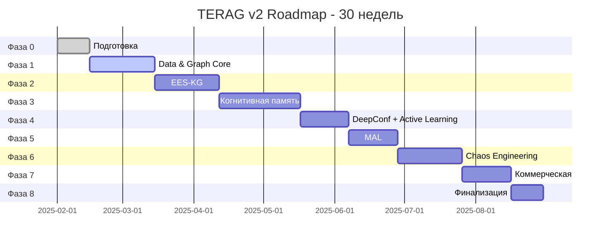

# 📊 TERAG v2 — Визуализации Roadmap

**Версия:** 1.0  
**Дата:** 2025-01-27

---

## 📅 Gantt Chart (для Notion/Jira)

### Упрощённая версия (30 недель)



---

## 🔗 Граф зависимостей (детальный)

```mermaid
graph TB
    subgraph "Фаза 0: Подготовка"
        A1[Ознакомление с документацией]
        A2[Настройка окружения]
        A3[CI/CD и версионирование]
        A4[Разделение ролей]
    end
    
    subgraph "Фаза 1: Data & Graph Core"
        B1[Kafka → Memgraph → Neo4j]
        B2[Schema Evolution Service]
        B3[KSDL v1.0]
        B4[Тестирование задержки]
    end
    
    subgraph "Фаза 2: EES-KG"
        C1[RDF/OWL импорт]
        C2[Neo4j Spatial]
        C3[Хранилище эмбеддингов]
        C4[EES-KG Schema]
        C5[Гибридные запросы]
    end
    
    subgraph "Фаза 3: Когнитивная память"
        D1[L0/L1/L2 хранилища]
        D2[Meta-Validator]
        D3[Meta-Controller]
        D4[PEMM ↔ HiAgent]
    end
    
    subgraph "Фаза 4: DeepConf"
        E1[Confidence Replay Buffer]
        E2[DeepConf ↔ PEMM]
        E3[Active Learning Loop]
        E4[Confidence heatmap]
    end
    
    subgraph "Фаза 5: MAL"
        F1[SemanticRouter → LiteLLM]
        F2[Model Telemetry]
        F3[Динамическая маршрутизация]
        F4[Fallback тестирование]
    end
    
    subgraph "Фаза 6: Chaos Engineering"
        G1[Chaos Sandbox]
        G2[Моделирование атак]
        G3[Логи и визуализация]
        G4[Отчёт устойчивости]
    end
    
    subgraph "Фаза 7: Коммерческая"
        H1[DCI и ROI расчёт]
        H2[White Paper 2.0]
        H3[KaaS API Gateway]
        H4[Демонстрация]
    end
    
    subgraph "Фаза 8: Финализация"
        I1[Синхронизация модулей]
        I2[Системный аудит]
        I3[Финальная документация]
        I4[Презентация TERAG v2]
    end
    
    A1 --> B1
    A2 --> B1
    A3 --> B1
    A4 --> B1
    
    B1 --> B2
    B2 --> B3
    B3 --> B4
    
    B4 --> C1
    C1 --> C2
    C2 --> C3
    C3 --> C4
    C4 --> C5
    
    B4 --> D1
    C5 --> D1
    D1 --> D2
    D2 --> D3
    D3 --> D4
    
    D4 --> E1
    E1 --> E2
    E2 --> E3
    E3 --> E4
    
    B4 --> F1
    E4 --> F1
    F1 --> F2
    F2 --> F3
    F3 --> F4
    
    D4 --> G1
    F4 --> G1
    G1 --> G2
    G2 --> G3
    G3 --> G4
    
    G4 --> H1
    H1 --> H2
    H2 --> H3
    H3 --> H4
    
    H4 --> I1
    I1 --> I2
    I2 --> I3
    I3 --> I4
    
    style A1 fill:#e1f5ff
    style A2 fill:#e1f5ff
    style A3 fill:#e1f5ff
    style A4 fill:#e1f5ff
    style B1 fill:#b3e5fc
    style B2 fill:#b3e5fc
    style B3 fill:#b3e5fc
    style B4 fill:#b3e5fc
    style C1 fill:#81d4fa
    style C2 fill:#81d4fa
    style C3 fill:#81d4fa
    style C4 fill:#81d4fa
    style C5 fill:#81d4fa
    style D1 fill:#4fc3f7
    style D2 fill:#4fc3f7
    style D3 fill:#4fc3f7
    style D4 fill:#4fc3f7
    style E1 fill:#29b6f6
    style E2 fill:#29b6f6
    style E3 fill:#29b6f6
    style E4 fill:#29b6f6
    style F1 fill:#03a9f4
    style F2 fill:#03a9f4
    style F3 fill:#03a9f4
    style F4 fill:#03a9f4
    style G1 fill:#0288d1
    style G2 fill:#0288d1
    style G3 fill:#0288d1
    style G4 fill:#0288d1
    style H1 fill:#0277bd
    style H2 fill:#0277bd
    style H3 fill:#0277bd
    style H4 fill:#0277bd
    style I1 fill:#01579b
    style I2 fill:#01579b
    style I3 fill:#01579b
    style I4 fill:#01579b
```



---

## 📊 Матрица зависимостей фаз

| Фаза | Зависит от | Критический путь | Параллельная работа |
|------|------------|------------------|---------------------|
| **Фаза 0** | - | ✅ | - |
| **Фаза 1** | Фаза 0 | ✅ | - |
| **Фаза 2** | Фаза 1 | ✅ | Частично с Фазой 3 |
| **Фаза 3** | Фаза 1, Фаза 2 | ✅ | - |
| **Фаза 4** | Фаза 3 | ✅ | - |
| **Фаза 5** | Фаза 1, Фаза 4 | ✅ | Частично с Фазой 6 |
| **Фаза 6** | Фаза 3, Фаза 5 | ✅ | - |
| **Фаза 7** | Фаза 6 | ✅ | - |
| **Фаза 8** | Все фазы | ✅ | - |

---

## 🎯 Критический путь проекта

```
Фаза 0 → Фаза 1 → Фаза 2 → Фаза 3 → Фаза 4 → Фаза 5 → Фаза 6 → Фаза 7 → Фаза 8
  (2)      (4)      (4)      (5)      (3)      (3)      (4)      (3)      (2)
```

**Общая продолжительность критического пути:** 30 недель

---

## 📈 Timeline визуализация (текстовая)

```
Неделя:  1   2   3   4   5   6   7   8   9   10  11  12  13  14  15  16  17  18  19  20  21  22  23  24  25  26  27  28  29  30
        ─────────────────────────────────────────────────────────────────────────────────────────────────────────────────────
Фаза 0:  ████
Фаза 1:      ████████████████████████████
Фаза 2:                                  ████████████████████████████
Фаза 3:                                                              ████████████████████████████████████
Фаза 4:                                                                                                  ███████████████████████
Фаза 5:                                                                                                                      ███████████████████████
Фаза 6:                                                                                                                                  ████████████████████████████
Фаза 7:                                                                                                                                                          ███████████████████████
Фаза 8:                                                                                                                                                                      ████████████████
```

---

## 🔄 Матрица параллельных задач

| Неделя | Параллельные задачи | Команды |
|--------|---------------------|---------|
| **3-4** | Фаза 1 (Graph Core) + Подготовка инструментов | GraphOps, DataOps |
| **7-8** | Фаза 2 (EES-KG) + Настройка хранилища эмбеддингов | GraphOps, DataOps |
| **11-12** | Фаза 3 (Память L0/L1/L2) + Подготовка Meta-Validator | AI-Core, Validation |
| **19-20** | Фаза 5 (MAL) + Подготовка Chaos Sandbox | AI-Core, Security |
| **26-27** | Фаза 7 (Коммерческая) + Финальная синхронизация | All teams |

---

## 📋 Таблица для импорта в Jira

### Формат CSV (для импорта в Jira)

```csv
Issue Type,Summary,Description,Priority,Assignee,Components,Labels,Epic Link,Story Points,Start Date,Due Date
Epic,Фаза 0: Подготовительная,Формирование основы для проектных артефактов,High,PM,Infrastructure,roadmap,TERAG-v2,5,2025-02-01,2025-02-14
Task,Ознакомление с документацией,Изучение TERAG_v2_Specification и EES-KG-концепции,Medium,All Teams,Documentation,roadmap,Фаза 0: Подготовительная,2,2025-02-01,2025-02-03
Task,Настройка окружения разработки,Установка Kafka, Neo4j, Memgraph, LiteLLM, SemanticRouter,High,InfraOps,Infrastructure,roadmap,Фаза 0: Подготовительная,5,2025-02-04,2025-02-10
Task,CI/CD и версионирование,Развёртывание тестового контура CI/CD,High,InfraOps,CI/CD,roadmap,Фаза 0: Подготовительная,3,2025-02-11,2025-02-13
Epic,Фаза 1: Data & Graph Core,Реализация потоковой архитектуры и двухуровневого графа знаний,Critical,GraphOps,Data Pipeline,roadmap,TERAG-v2,13,2025-02-15,2025-03-14
Task,Kafka → Memgraph → Neo4j поток,Настройка потоковой передачи данных,Critical,DataOps,Data Pipeline,roadmap,Фаза 1: Data & Graph Core,8,2025-02-15,2025-03-01
Task,Schema Evolution Service,Создание микросервиса для синхронизации схем EES-KG,High,GraphOps,Graph Core,roadmap,Фаза 1: Data & Graph Core,5,2025-03-02,2025-03-08
Task,KSDL v1.0 версионирование,Разработка системы версионирования схем,High,GraphOps,Graph Core,roadmap,Фаза 1: Data & Graph Core,5,2025-03-09,2025-03-13
Task,Тестирование задержки,Проверка latency ≤ 1 сек,Medium,DataOps,Testing,roadmap,Фаза 1: Data & Graph Core,3,2025-03-14,2025-03-14
```

---

## 📊 Прогресс-бар (шаблон для Notion)

### Формула для Not式

```
Progress = (Completed Tasks / Total Tasks) * 100
```

### Таблица прогресса

| Фаза | Задач всего | Задач выполнено | Прогресс | Статус |
|------|-------------|-----------------|----------|--------|
| Фаза 0 | 4 | 0 | 0% | 🔴 Не начато |
| Фаза 1 | 4 | 0 | 0% | 🔴 Не начато |
| Фаза 2 | 5 | 0 | 0% | 🔴 Не начато |
| Фаза 3 | 4 | 0 | 0% | 🔴 Не начато |
| Фаза 4 | 4 | 0 | 0% | 🔴 Не начато |
| Фаза 5 | 4 | 0 | 0% | 🔴 Не начато |
| Фаза 6 | 4 | 0 | 0% | 🔴 Не начато |
| Фаза 7 | 4 | 0 | 0% | 🔴 Не начато |
| Фаза 8 | 4 | 0 | 0% | 🔴 Не начато |
| **Итого** | **37** | **0** | **0%** | 🔴 |

---

## 🎨 Цветовая схема для визуализаций

### По фазам

- **Фаза 0:** `#e1f5ff` (Светло-голубой)
- **Фаза 1:** `#b3e5fc` (Голубой)
- **Фаза 2:** `#81d4fa` (Средний голубой)
- **Фаза 3:** `#4fc3f7` (Яркий голубой)
- **Фаза 4:** `#29b6f6` (Синий)
- **Фаза 5:** `#03a9f4` (Тёмно-синий)
- **Фаза 6:** `#0288d1` (Очень тёмный синий)
- **Фаза 7:** `#0277bd` (Морской синий)
- **Фаза 8:** `#01579b` (Тёмно-морской)

### По статусу

- 🔴 **Не начато:** `#f44336` (Красный)
- 🟡 **В процессе:** `#ff9800` (Оранжевый)
- 🟢 **Завершено:** `#4caf50` (Зелёный)

---

## 📥 Инструкции по экспорту

### Для Notion

1. Скопируйте Mermaid диаграммы
2. Используйте блок "Mermaid" в Notion
3. Вставьте код диаграммы
4. Notion автоматически отобразит визуализацию

### Для Jira

1. Используйте CSV-файл для импорта задач
2. Настройте поля в Jira (Epic, Task, Story Points)
3. Импортируйте через CSV Import
4. Создайте Gantt chart через Jira Roadmap

### Для Miro

1. Экспортируйте Mermaid диаграммы в PNG/SVG
2. Импортируйте изображения в Miro
3. Добавьте текстовые аннотации
4. Создайте связи между элементами

---

**Документ подготовлен:** 2025-01-27  
**Версия:** 1.0


